# Guía de usuario - MiClienteFTP

Bienvenidos a la guía de usuario sobre la aplicación MiClienteFTP, la cual es una implementación de un sencillo cliente FTP que permite explorar el sistema de ficheros de un servidor, descargar archivos y generar un documento PDF con el contenido del directorio donde te encuentres.

## Descripción de la interfaz

Para comenzar con la guía se va a detallar la interfaz por partes, mostrando las diferentes ventanas que incluye la aplicación.

### Ventana principal:

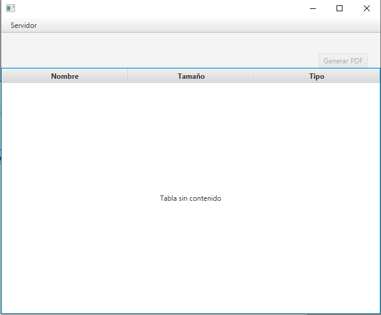

Como se puede ver en la imagen la ventana principal es algo simple la cual cuenta con un **menú** en la parte superior izquierda, por otro lado cuenta con una **etiqueta** debajo de la barra del menu, tambien se encuentra un **boton** el cual sirve para generar un PDF y por ultimo se encuentra una **tabla** la cual contiene los valores de los contenidos del sistema de archivos del servidor.

#### Menú

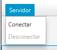

El menu cuenta con dos items uno para conectar con el servidor ftp, donde al pulsarlo abre otra ventana para introducir los datos de la conexión con el servidor FTP. y por otro lado esta el item de desconectar sirve para finalizar la conexión con el servidor FTP. El item de desconectar se encuentra desactivado al entrar en la aplicación debido a que no se a realizado la conexión una vez se realice una conexión con el servidor FTP cambiaria es estado al reves es decir que conectar estaria desabilitado y desconectar se activaria.

##### Ventana conectar

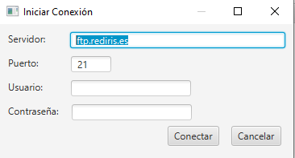

En la imagen anterior se puede ver la ventana que se abre al pulsar el item conectar del menu. Aqui temos dos modos de realizar conexión uno seria el modo anonimo "sin usuario ni contraseña" y por otro lado se puede introducir el nombre de usuario y contraseña en concreto. Para realizar la conexión pulsar el boton conectar. Si se pulsa en cancelar se cierra la ventana, se vuelve a la ventana anterior y no realiza la conexión.

#### Etiqueta

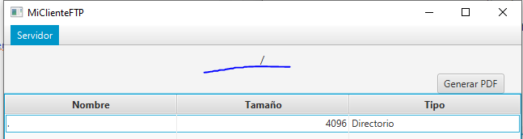

En la imagen se puede ver la etiqueta la cual de primera no tiene valor y sera donde se muestra la ruta actual dentro del sistema de archivos del servidor FTP "Por defecto se encuentra en /". Para que se muestre el valor de la ruta se necesita primero estar conectado al servidor FTP.

#### Boton Generar PDF

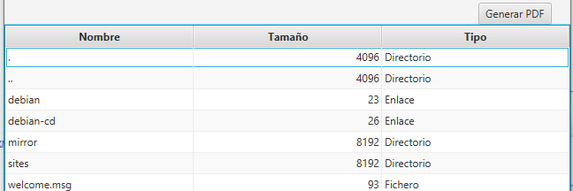

Este boton se encuentra desactivado al entra a la aplicación, para habilitarlo necesitamos tener una sesión realizada con el servidor. Una vez esta habilitado el boton si lo pulsamos nos va a generar un fichero PDF con el contenido de la tabla que contiene los ficheros y subdirectorios del directorio actual "ruta donde pulsamos el boton".

#### Tabla

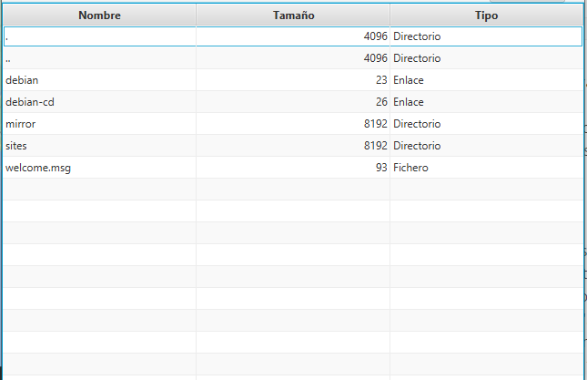

Esta tabla contiene tres columnas las cuales contiene la informacion del nombre del fichero, el tamaño y el tipo. La tabla se va a rellenar de datos una vez que realicemos la conexión con el servidor y por defecto comenzara a mostrar el contenido del directorio raiz del servidor FTP "/". Si hacemos doble click sobre una fila la cual es de tipo "directorio" o "enlace" nos vamos a mover de directorio y se va a actualizar el contenido de la misma tabla con los correspondientes ficheros y subdirectorios que contenga el mismo. Y si hacemos doble click sobre una fila la cual es de tipo fichero se va a abrir una ventana emergente con el explorador de archivos para seleccionar donde guardar el fichero seleccionado. Por ultimo para volver hacia atras con hacer doble click sobre la fila que contiene el nombre de ".." para ir al directorio anterior.

## Como se usa

Para comenzar vamos al menu y pulsamos la parte de conectar "Para realizar la conexión con el servidor FTP"

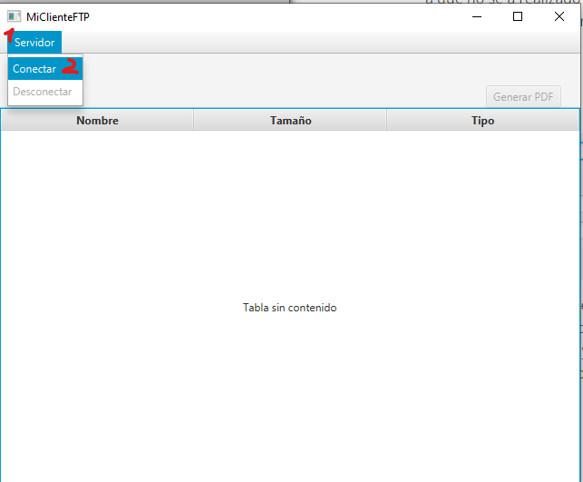

Se abrira una nueva ventana para introducir los datos del servidor en este caso seran los siguientes:

            Servidor: ftp.rediris.es   "ya esta por defecto"

            Puerto: 21  "ya esta por defecto"

            Usuario: chuck

            Contraseña: norris

y con esto le damos a conectar y ya dependiendo de si se se realizo con exito o si fallo al realizarse la conexión nos mostrar una ventana donde nos indicara.

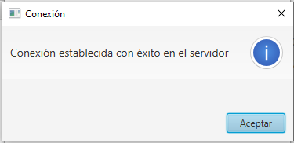

Si se realiza la conexión al cerrar la ventana emergente donde avisa del exito de la conexión se van a rellenar la etiqueta con el valor de la ruta en la que nos encontramos dentro del servidor FTP y tambien se rellena la tabla con los datos de los ficheros, subdirectorios y enlaces que se encuentran dentro del servidor.

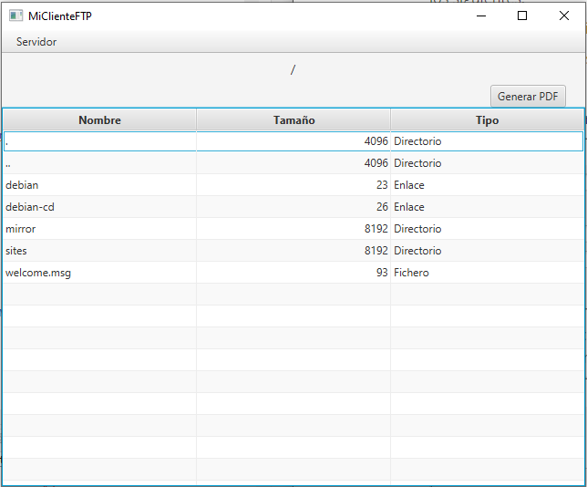

Para movernos entre las difenrentes rutas podemos hacer doble click en las filas que son de tipo "directorio" o "enlace" y si queremos volver atras podemos hacer doble click en la fila que contiene el nombre ".."

Y por ultimo realizamos la desconexión con el servidor. Para ello pulsamos el item de Desconectar que se encuentra dentro del menu. Con esto basta para realizar la desconexión con servidor FTP.

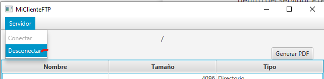

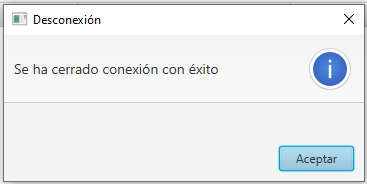

Una vez cerrada la conexión con el servidor se vacian los datos de la tabla y se vuelve a activar el item del menu conectar, se desactiva el item del menu desconectar y tambien se desactiva el boton de generar PDF. Debido a que ya no hay una conexion activa.

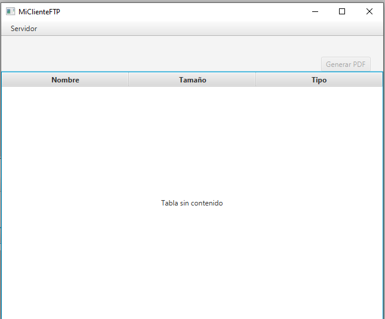

Con esto ya estaria descrita la interfaz que usa la aplicación y como se puede usar la misma.

Un saludo,

Francisco Yeray Gómez Carrion -- NntoCNRY 
